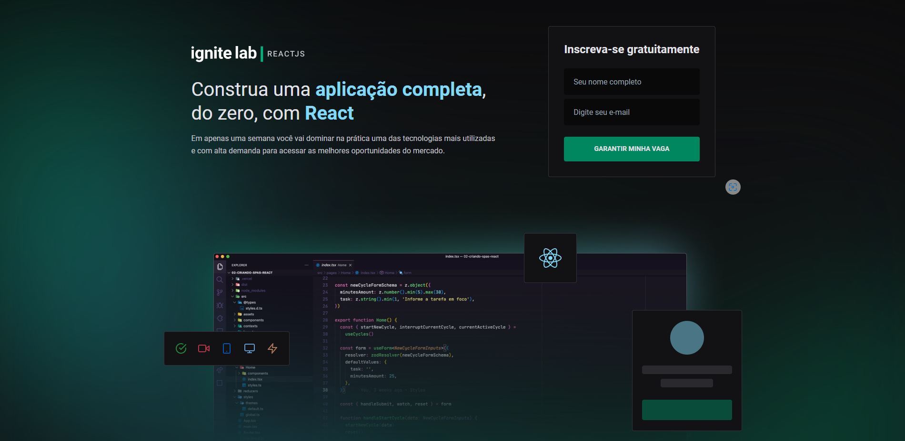
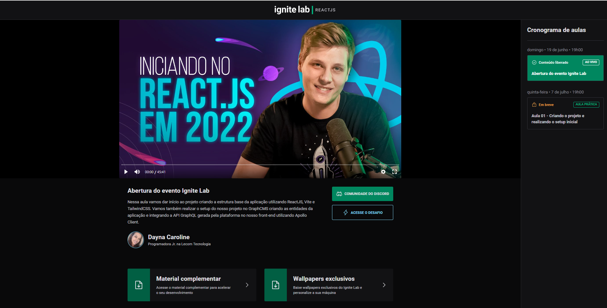

# Event Plataform - Ignite Lab | Rocketseat 🚀

### Plataforma de eventos desenvolvida durante o Ignite Lab da Rocketseat

* Projeto: https://event-platform-gamma-five.vercel.app/

<div align="center" display="flex">
    
    
</div>

## 📌 Tecnologias
* ReactJS
* Typescript
* Vite
* Graphql
* Apollo
* Tailwindcss
* Vime

## 📌 Como Executar 

```
# Clone o repositório
git clone git@github.com:Dayna-Caroline/event-platform.git

# Acesse a pasta do projeto
cd event-platform

# Instale as dependências
npm i

# Inicialize o projeto
npm run dev
```
